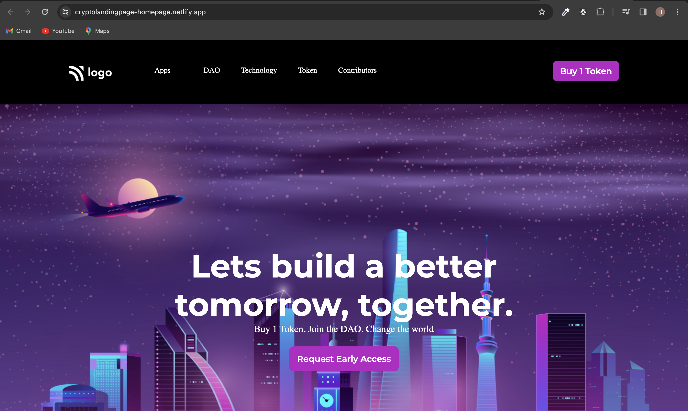

### Project Name : Unveiling the Future: Crypto Landing Page!
Welcome to our Crypto Landing Page, a dynamic online gateway into the world of cryptocurrencies and blockchain technology. Hosted on Netlify, this project is designed to provide users with essential information and captivating visuals, serving as a comprehensive introduction to the crypto universe.

### This project developed with pure HTML and CSS mainly focused on positions.

[Crypto Landing page](https://cryptolandingpage-homepage.netlify.app/)

 
 

### Technologies Used

 

HTML and CSS:
The backbone of our project, HTML and CSS collaborate to create an aesthetically pleasing and user-friendly interface.

Netlify Hosting:
Leveraging the power of Netlify for seamless deployment, hosting, and continuous integration, ensuring a reliable and scalable platform.

### Demo :

### You can Check it Live on Below Link :

[Live Link !](https://cryptolandingpage-homepage.netlify.app/)

